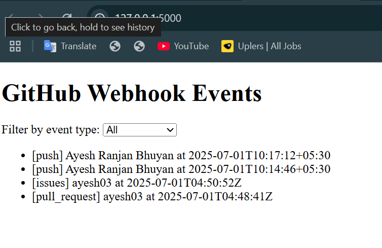
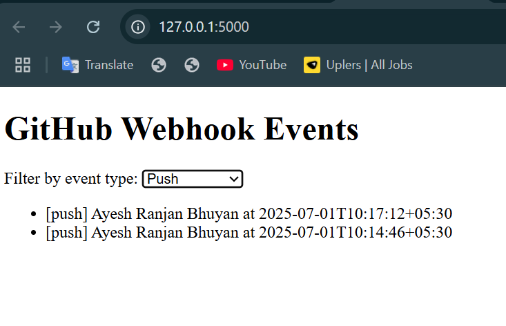
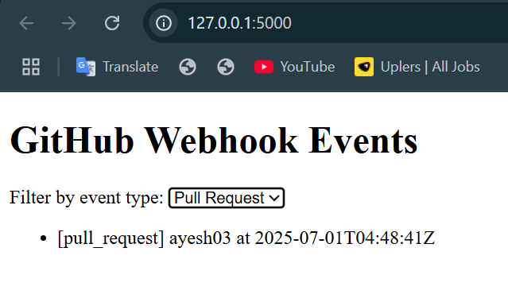
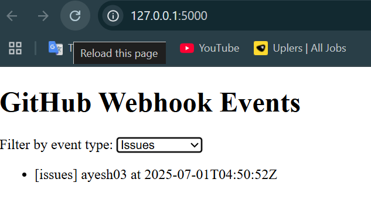

# Webhook Receiver for GitHub Events

This project is a **Flask-based webhook receiver** that listens to GitHub events from a separate repository (`action-repo`) and stores them in **MongoDB**. It also includes a minimal **frontend UI** that polls every 15 seconds to show the latest GitHub events (Push, Pull Request, Issue, and optionally Merge).

---

##  Features

- Receives GitHub webhooks from [`action-repo`](https://github.com/ayesh03/action-repo)
- Handles the following event types:
  - `push`
  - `pull_request`
  - `issues`
- Stores essential event data in MongoDB
- Frontend UI:
  - Polls backend every 15 seconds
  - Filters by event type (All, Push, Pull Request, Issues)
  - Displays formatted event messages

---

##  Webhook Event Formats

- **Push:**

  ```
  {author} pushed to {to_branch} on {timestamp}
  ```

- **Pull Request:**

  ```
  {author} submitted a pull request from {from_branch} to {to_branch} on {timestamp}
  ```

- **(Bonus) Merge:**

  ```
  {author} merged branch {from_branch} to {to_branch} on {timestamp}
  ```

---

## MongoDB Schema

All events are stored in the `webhook_db.webhook_events` collection.

Example document for a pull request:

```json
{
  "author": "ayesh03",
  "title": "Test PR",
  "body": "Testing pull request event",
  "timestamp": "2025-07-01T04:13:44Z",
  "pr_number": 5,
  "event_type": "pull_request"
}
```

---

##  Tech Stack

- Python (Flask)
- MongoDB (local)
- HTML + JavaScript (Vanilla)
- GitHub Webhooks

---

##  UI Preview

The UI fetches updates from MongoDB every 15 seconds and shows the latest events.

| All Events | Push Events |
|------------|-------------|
|  |  |

| Pull Request Events | Issue Events |
|---------------------|--------------|
|  |  |

---

## ⚙️ Setup Instructions

1. **Clone the repository:**

   ```bash
   git clone https://github.com/ayesh03/webhook-repo.git
   cd webhook-repo
   ```

2. **Install dependencies:**

   ```bash
   pip install -r requirements.txt
   ```

3. **Start MongoDB**  
   Make sure MongoDB is running on `localhost:27017`.

4. **Run the Flask app:**

   ```bash
   python app.py
   ```

5. **Open in browser:**

   ```
   http://127.0.0.1:5000
   ```

---

## 🔗 GitHub Webhook Setup

1. Go to your `action-repo`
2. Navigate to: **Settings → Webhooks → Add webhook**
3. Fill the form:
   - **Payload URL**: `https://1c07-203-192-253-152.ngrok-free.app/webhook`
   - **Content Type**: `application/json`
   - **Events**: Select "Just the push event", "Pull requests", and "Issues"

---

##  Folder Structure

```
webhook-repo/
├── templates/
│   └── index.html
├── issue_event.png
├── pull_events.png
├── push_events.png
├── all_events.png
├── app.py
├── README.md
└── requirements.txt
```

---

##  Author

**Ayesh Ranjan Bhuyan**  
Feel free to check out both repositories:

- 🔗 [action-repo](https://github.com/ayesh03/action-repo)
- 🔗 [webhook-repo](https://github.com/ayesh03/webhook-repo)
